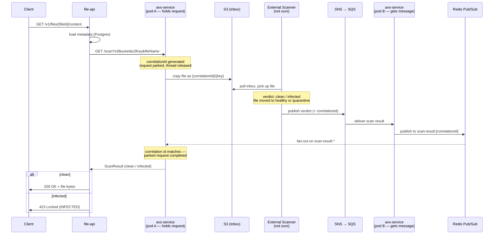
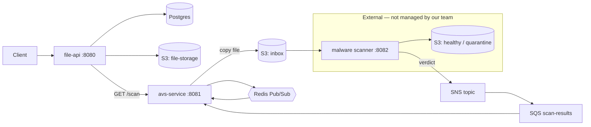

# AVS POC — Virus Scanning with Redis Pub/Sub

High-level overview of the proof of concept. This document intentionally stays away from code
details — see the root `README.md` for the step-by-step walkthrough.

---

## Redis in a nutshell — who subscribes, who publishes, when

**Only `avs-service` touches Redis.** It is both the publisher and the subscriber — `file-api` and
the external scanner have no Redis connection at all.

**Subscribing** happens **once, at startup**. Every `avs-service` pod subscribes to the *wildcard*
pattern `scan:result:*` when the application boots. One subscription per pod covers every scan that
will ever run — nothing subscribes when a scan starts, nothing unsubscribes when it ends.

**Publishing** happens **when a scan verdict arrives from SQS**. The pod that consumes the message
publishes it to a *narrow, scan-specific* channel: `scan:result:{correlationId}`.

That mismatch — narrow publish, broad subscribe — is the whole trick:

- SQS hands the verdict to **one arbitrary pod**, which may not be the pod holding the client's
  waiting connection.
- That pod publishes to Redis, and **all pods receive it**, because they all match the pattern.
- Only the pod that actually parked that `correlationId` recognises it and completes the waiting
  request. The other pods look it up, find nothing, and silently ignore the message.

So a single request can touch three different threads across two different pods: pod A parks the
HTTP request, pod B consumes the SQS message and publishes to Redis, and pod A's Redis listener
picks it back up and answers the client.

The rest of this document explains why it is built this way.

---

## What problem does this solve?

A client asks for a file over plain HTTP and expects the bytes back in a single response.
The virus scanner, however, is **asynchronous**: you hand it a file and it tells you the verdict
later, over a message queue. There is no request/response API to call.

On top of that, the service that waits for the verdict runs as **multiple pods behind a load
balancer**. The pod that receives the scan result from the queue is very likely *not* the pod
that is holding the client's open HTTP connection.

This POC bridges those two worlds:

- **Async → sync**: the caller gets one blocking-looking HTTP call, while internally nothing blocks.
- **Cross-pod delivery**: Redis Pub/Sub fans the scan result out to every pod, so whichever pod is
  actually holding the waiting connection can finish it.

---

## The three services

| Service | Port | Role | Owned by us? |
|---|---|---|---|
| **file-api** | 8080 | Public REST API. Uploads files to S3, stores metadata in Postgres, and refuses to serve a file until it has been declared clean. | Yes |
| **avs-service** | 8081 | The bridge. Accepts a synchronous scan request, submits the file to the external scanner, waits for the async verdict, and answers the original HTTP call. | Yes |
| **external-malware-scanner-service** | 8082 | A **mock** of a third-party scanner. In real life this is someone else's system — we cannot change it, we can only drop files where it looks and listen where it publishes. | No (simulated) |

### Supporting infrastructure

- **Postgres** — file metadata (id, filename, S3 location, MIME type).
- **S3 (LocalStack)** — `file-storage` plus the scanner's `inbox`, `healthy` and `quarantine` buckets.
- **SNS → SQS (LocalStack)** — how the external scanner announces its verdicts.
- **Redis** — Pub/Sub channel that routes a verdict to the correct pod.

---

## How it works

### Upload

The client posts a file to `file-api`. It is stored in S3 under `{fileId}/{filename}`, metadata is
written to Postgres, and the `fileId` comes back. **No scanning happens at upload time.**

### Download (the interesting part)

Scanning happens on download, so a file is verified at the moment it is actually served.

1. **file-api** looks up the metadata and calls **avs-service** synchronously — from its point of
   view this is one ordinary HTTP call that just happens to take a few seconds.
2. **avs-service** mints a `correlationId`, parks the request, and copies the file into the
   scanner's inbox bucket under the key `{correlationId}/{originalKey}`. The correlation id rides
   along *inside the S3 key* — that is the only channel we have to a system we do not control, and
   it means no shared database or metadata lookup is needed to match a verdict back to a request.
   The worker thread is released immediately; the HTTP connection stays open but costs nothing.
3. **The external scanner** picks the file up, decides clean or infected (the mock just looks for
   `eicar` in the filename), files it into the `healthy` or `quarantine` bucket, and publishes the
   verdict to an SNS topic. The message carries the `correlationId` it read off the key.
4. **SNS delivers to SQS**, and **avs-service** consumes it — but the consuming pod may be the
   wrong one.
5. So the consumer republishes the verdict to Redis on channel `scan:result:{correlationId}`. Every
   pod subscribes to the wildcard `scan:result:*`, so all of them see it; only the pod actually
   holding that correlation id acts on it and completes the parked request.
6. **file-api** gets its answer: clean → stream the bytes from S3 with `200 OK`;
   infected → `423 Locked` with an `INFECTED` status body.

If no verdict arrives within the timeout (30s), the parked request is failed with a timeout result
rather than hanging forever.

---

## Flow diagram



### Component view



---

## Why these pieces

**Parked (deferred) requests** — the caller sees a normal synchronous call, but no server thread
sits idle waiting. Thousands of concurrent scans can be in flight on a small thread pool.

**Redis Pub/Sub, not a shared cache or DB** — the problem is *routing*, not storage. The verdict has
to reach one specific pod, and Pub/Sub fan-out with a wildcard subscription solves that with a
single subscription per pod and no per-request subscribe/unsubscribe.

**Correlation id in the S3 key** — the only way to carry our request identity through a system we
have no control over and get it back in the verdict.

**Scan on download, not on upload** — the file is verified at the moment it is served, and virus
definitions may have changed since it was uploaded.

---

## Running it

```bash
docker compose up -d          # LocalStack (S3/SNS/SQS), Postgres, Redis
# then start each service: file-api, avs-service, external-malware-scanner-service
```

Sample files live in `external files/` — `example_image.jpg` (clean) and
`eicar_inffected_example_image.jpg` (triggers the infected path), along with a Postman collection.
`commands.txt` in the project root has handy AWS CLI commands for inspecting the buckets.

---

## POC caveats

This is a proof of concept, not production code. Notably:

- The "scanner" decides infection by looking for `eicar` in the filename — no real scanning engine.
- Credentials and endpoints are hardcoded for LocalStack.
- Verdicts are not cached, so every download re-scans the file.
- Failure handling (retries, dead letters, poison messages) is minimal.
